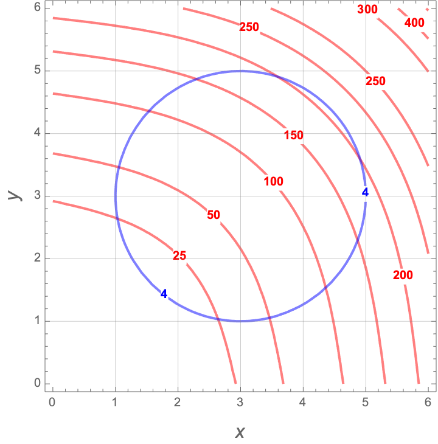
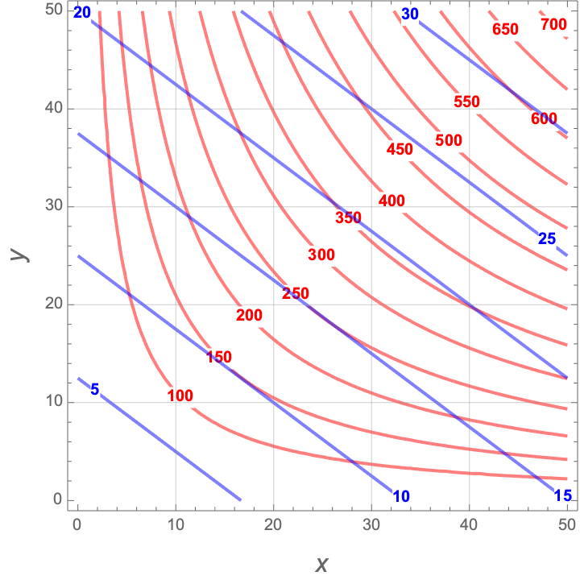

# 5.D Constrained 2D Optimization

## Creating a Contour Plot for 2D Optimization

Here is some example code to create a plot of an objective function $P(x,y) =  x^{0.2} y^{0.8}$ and a constraint function $Q(x,y)=4x + 3y=200$.


```{r constrained-opt-plot1}

P = makeFun( x^(0.2) * y^(0.8) ~ x&y)
Q = makeFun( 4*x + 3*y ~ x&y)

contour_plot(P(x,y)~x&y, domain(x=0:40, y=20:80), 
             contours_at=seq(20,70,6), skip=0) |>
  contour_plot(Q(x,y) ~ x & y, contour_color="black", 
               contours_at=c(200), label_placement=.25)

```


## Activities

### Constrained Production

A company produces $P(x,y) = 100 x^{4/11} y^{7/11}$ units of its product from raw materials $x$ and $y$. The cost of each unit of $x$ is \$5 and the cost of each unit of $y$ is \$4.

1. Find the maximal output for a budget of \$500, along with how much input $x$ and $y$ is used to create them. (Hint: plot your contour diagram on the domain $0 \leq x \leq 100$ and $0 \leq y \leq 100$. Start with the **default** contours by removing the `levels` input.)

2. What is the maximal output if the unit cost of $x$ increases to \$7? How much of inputs $x$ and $y$ are used?

3. What is the maximal output if the unit cost of $x$ returns to \$5 and the budget is decreased to \$300? How much of inputs $x$ and $y$ are used?

### Constrained Optimization on a Circle

Below is a plot of an objective function $f(x,y)$ in red, and its constraint function $g(x,y)=4$ in blue. 

1. Estimate  the **minimum** value of $f(x,y)$ constrained to $g(x,y)=4$. What point achieves this minimum?
1. Estimate  the **maximum** value of $f(x,y)$ constrained to $g(x,y)=4$. What point achieves this maximum?

{width=50%}


### Estimating the Lagrange Multiplier

Below is a plot of an objective function $f(x,y)$ in red, and its constraint function $g(x,y)$ for various budgets in blue (in thousands of dollars). 

{width=50%}

1. Estimate the point $(x,y)$ that  maximizes production for a budget of $g(x,y)=15$. What is the production level?
2. Estimate the point $(x,y)$ that maximizes production for a budget of $g(x,y)=20$. What is the production level?
3. What is the value of the Lagrange multiplier for the budget $g(x,y)=15$? What are the units? What does this number mean?
4. What price would make this increase useful to the company? (Hint: the units for your answer are "dollars per unit produced.")


## Solutions

### Constrained Production


1. Here is our plot of the objective function $P(x,y)$ and the constraint $Q(x,y) = 500$.

```{r constrained-opt-plot2 , message=FALSE}

P = makeFun( x^(4/11) * y^(7/11) ~ x&y)
Q = makeFun( 5*x + 4*y ~ x&y)

contour_plot(P(x,y)~x&y, domain(x=0:100, y=0:100), skip=0) |> 
  contour_plot(Q(x,y) ~ x & y, contour_color="black", 
               contours_at=c(500), label_placement=.25)

```


The maximum output for our budget occurs where the $Q(x,y)=500$ constraint is tangent to a contour of $P(x,y)$. This occurs at (approximately) the point $(38,78)$ and we estimate that the maximum production is $P(38,78)=60$.

2. We need to make a new plot using an updated objective function. 

```{r constrained-opt-plot3, message=FALSE}

P = makeFun( x^(4/11) * y^(7/11) ~ x&y)
Q = makeFun( 7*x + 4*y ~ x&y)

contour_plot(P(x,y)~x&y, domain(x=0:100, y=0:100), skip=0) |> 
  contour_plot(Q(x,y) ~ x & y, contour_color="black", 
               contours_at=c(500), label_placement=.25)

```


Now, the constraint isn't tangent to any of the shown contours, but it IS tangent to a contour that we haven't drawn! That point is somewhere around (25, 80), and the optimal productions probably around 52 or so. Let's make another plot on a smaller domain and pick some contours to draw.

```{r constrained-opt-plot4, message=FALSE}
contour_plot(P(x,y)~x&y, domain(x=0:50, y=50:100), skip=0, 
             contours_at = seq(23,73,5)) |> 
  contour_plot(Q(x,y) ~ x & y, contour_color="black", 
               contours_at=c(500), label_placement=.25)
```

After some experimentation, I realized that $P(x,y)=53$ is the contour that is tangent $Q(x,y)=500$. So the optimal point is $(26,80)$ and the optimal output is 53.

3. Now we return to the original constraint function, but decrease the budget to $300$.

```{r constrained-opt-plot5, message=FALSE}

P = makeFun( x^(4/11) * y^(7/11) ~ x&y)
Q = makeFun( 7*x + 4*y ~ x&y)

contour_plot(P(x,y)~x&y, domain(x=0:50, y=25:75), skip=0) |> 
  contour_plot(Q(x,y) ~ x & y, contour_color="black", 
               contours_at=c(300), label_placement=.25)
```

The optimal point is at $(21,40)$ and the optimal production is approximately $f(21,40)=32$.

### Constrained Optimization on a Circle

1. The minimum is approximately $f(1.5, 1.5) = 20$.
1. The maximum is approximately $f(4.5, 4.5) = 210$.


### Estimating the Lagrange Multiplier

1. For a budget of 15, the maximal production is $f(25,18)=250$.
2. For a budget of 20, the maximal production is $f(32,26)=360$. 
3. The Lagrange multiplier is
$$
\lambda = \frac{\triangle \mbox{production}}{\triangle \mbox{constraint}} \approx \frac{360-250}{20-15}=\frac{110}{5}=22  \frac{\mbox{units}}{\mbox{dollar}}
$$
So if we increase our budget by \$1, then we will produce 22 more units.

4. The Lagrange multiplier is approximately $22$ units/dollar. We will break even if we can sell one unit for $1/22=0.045$ dollars/unit. So if the sale price is at least \$0.045, we will decide to increase production.


