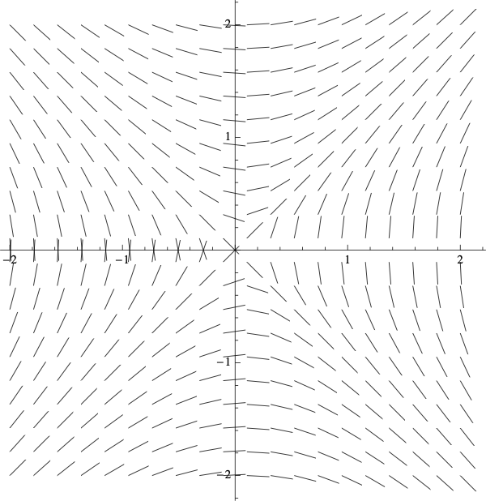
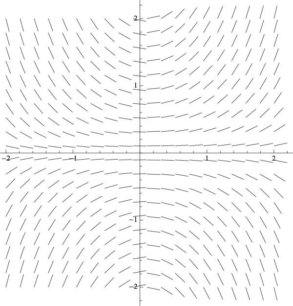
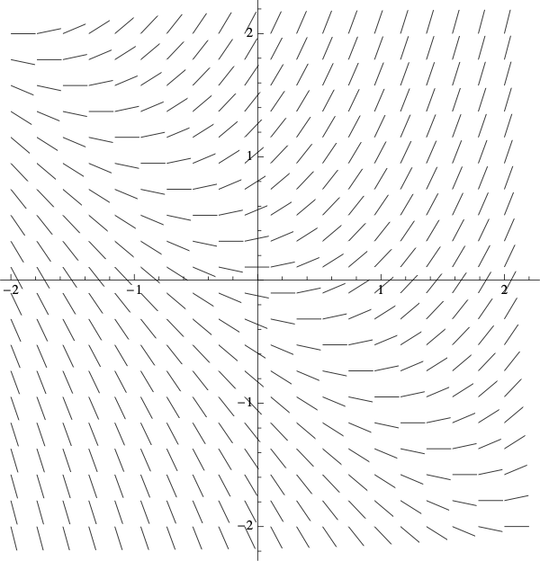
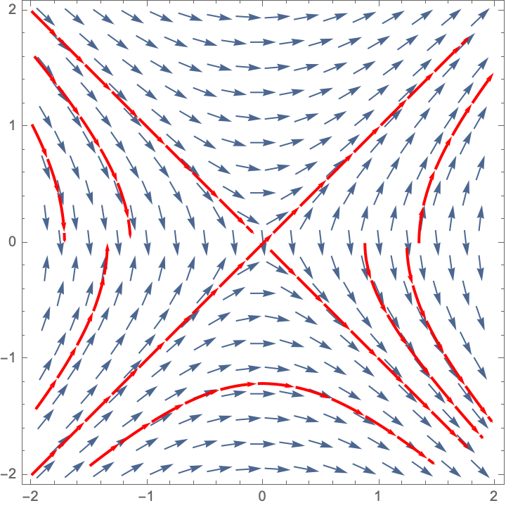
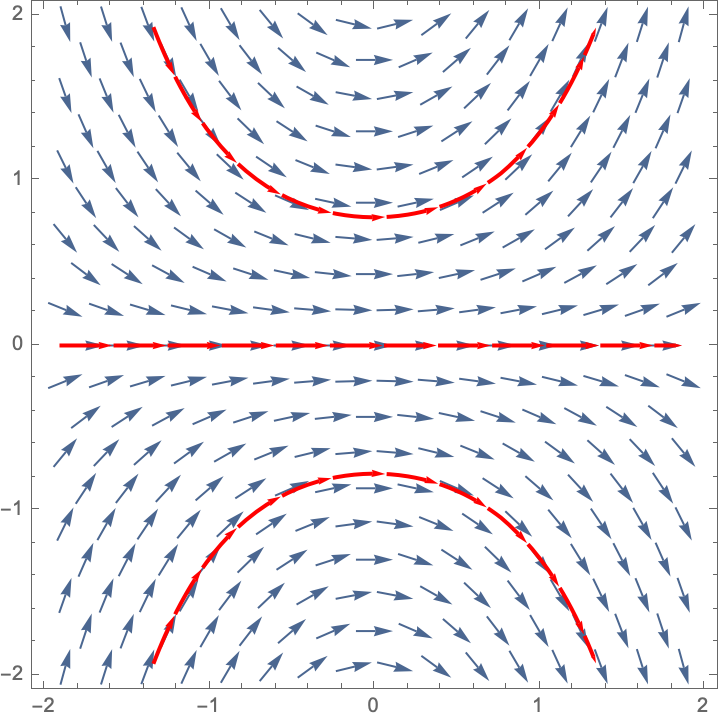
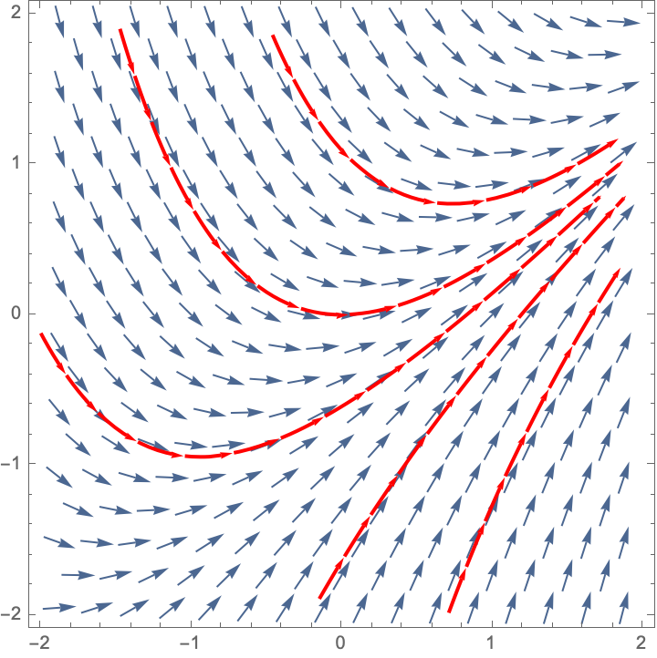
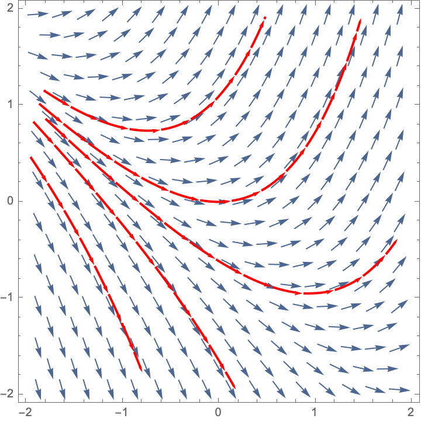

# 7.D Slope Fields

## Creating a Slope Field in RStudio

The `mosaicCalc` package has a `vectorfield_plot` function that we use to create a slope field. So we need to make sure that this package has been loaded into RStudio.

```{r}
suppressPackageStartupMessages(library(mosaicCalc))
```

Here is the code to create the slope field for $\displaystyle{\frac{dP}{dt} = 6 - 2 P}$


```{r}
vectorfield_plot(t ~ 1,
P ~ 6 - 2 * P,
bounds(t=-8:8, P=-8:8))
```

## Creating a Trajectory in RStudio

The `mosaicCalc` package also has a `traj_plot` function that plots a solution curve to a differential equation through a given initial point.

Here is the code to plot the trajectory starting at $P(0)=6$ for the differential equation $\displaystyle{\frac{dP}{dt} = 6 - 2 P}$. In the code below, the `nt` parameter indicated the number of "tick marks" to use along the trajectory.

```{r, message=FALSE}
dyn = makeODE( dP ~  6 - 2 * P )
soln = integrateODE(dyn, domain(t=0:5), P=6)
traj_plot(P(t) ~ t, soln,  nt=5) 
```

In fact, we can get fancier by making a single plot that has two trajectories (one for $P(0)=6$ and one for $P(0)=2$) along with the vector field.

```{r, message=FALSE}
dyn = makeODE( dP ~  6 - 2 * P )
soln1 = integrateODE(dyn, domain(t=0:5), P=6)
soln2 = integrateODE(dyn, domain(t=0:5), P=2)
traj_plot(P(t) ~ t, soln1, color="blue", nt=0) %>%
  traj_plot(P(t) ~ t, soln2, color="magenta", nt=0) %>%
  vectorfield_plot(t ~ 1, P ~ 6 - 2 * P, bounds(t=0:5, P=0:8))
```

## Activities


### Match the Slope Field


Match each of the following differential equations with its slope field. *Hint:* start by setting $\frac{dy}{dx} = 0$ and solving for $y$. The slopes along the resulting curve will always be horizontal.


1. $\displaystyle{\frac{dy}{dx}=xy}$
1. $\displaystyle{\frac{dy}{dx}=\frac{x}{y}}$
1. $\displaystyle{\frac{dy}{dx}=x+y}$
1. $\displaystyle{\frac{dy}{dx}=x-y}$

<table>
<tr>
<td> Slope Field A</td>
<td> Slope Field B</td>
</tr>
<tr>
<td>
{width=100%}
</td>
<td>
{width=100%}
<tr>
<td></td>
<td></td>
</tr>
<tr>
<td> Slope Field C</td>
<td> Slope Field D</td>
</tr>
</td>
</tr>
<tr>
<td>
{width=100%}
</td>
<td>
{width=100%}
</td>
</tr>
</table>

### Draw Some Trajectories

For each of the above slope fields, sketch the solution curves that satisfy

1. $y(0) = 1$
1. $y(0) = 0$
1. $y(0) = -1$


### Removing a Pollutant

A pollutant spilled on the ground decays at a rate of 4\% a day. In addition, cleanup crews remove the pollutant at a rate of 20 gallons a day. 

1. Write a differential equation for the amount of pollutant $P$, in gallons, left after $t$ days.
1.  The initial amount of pollutant is 2000 gallons. Use the `plot_traj` command to create a trajectory for $0 \leq t \leq 50$. Set `nt=10` to show 10 tick marks on your trajectory.
1. Use the trajectory to estimate long it takes to clean up the pollutant. In other words, when is $P(t)=0$?
 

### Slope Fields for Population Models

Create a slope field for each of the following population models. For each one, describe the long-term behavior for a variety of intial populations. For which initial values of $P$ does the population increase without bound? stabilize to a constant value? die out? 

1. Exponential growth with harvesting.
$$
\frac{dP}{dt} = 0.2 P - 40
$$
for  $0 \leq P \leq 300$ and $0 \leq t \leq 100$.


2. Constrained growth
$$
\frac{dP}{dt} = 0.05 P  (1 - 0.002 P) 
$$
for  $0 \leq P \leq 600$ and $0 \leq t \leq 50$.


3. Constrained growth with constant harvesting
$$
\frac{dP}{dt} = 0.05 P  (1 - 0.002 P) - 4
$$
for  $0 \leq P \leq 600$ and $0 \leq t \leq 50$.

### Trajectories for Population Models

Now create trajectories for the population models in the previous exercise. Create a trajectory for each of the different possible outcomes (increase without bound, stabilize to a constant value, die out) 

1. Exponential growth with harvesting.
$$
\frac{dP}{dt} = 0.2 P - 40
$$
for  $0 \leq P \leq 300$ and $0 \leq t \leq 100$.


2. Constrained growth
$$
\frac{dP}{dt} = 0.05 P  (1 - 0.002 P) 
$$
for  $0 \leq P \leq 600$ and $0 \leq t \leq 50$.


3. Constrained growth with constant harvesting
$$
\frac{dP}{dt} = 0.05 P  (1 - 0.002 P) - 4
$$
for  $0 \leq P \leq 600$ and $0 \leq t \leq 50$.


## Solutions

### Match the Slope Fields

1. $\displaystyle{\frac{dy}{dx}=xy}$ is Slope Field B 
1. $\displaystyle{\frac{dy}{dx}=\frac{x}{y}}$ is Slope Field A
1. $\displaystyle{\frac{dy}{dx}=x+y}$ is Slope Field D
1. $\displaystyle{\frac{dy}{dx}=x-y}$ is Slope Field C

### Draw Some Trajectories

Here are some trajectories (not necessarily the ones that go through the three points specified).

<table>
<tr>
<td> Slope Field A</td>
<td> Slope Field B</td>
</tr>
<tr>
<td>
{width=100%}
</td>
<td>
{width=100%}
<tr>
<td></td>
<td></td>
</tr>
<tr>
<td> Slope Field C</td>
<td> Slope Field D</td>
</tr>
</td>
</tr>
<tr>
<td>
{width=100%}
</td>
<td>
{width=100%}
</td>
</tr>
</table>


### Removing a Pollutant

 

1. The differential equation for the pollutant removal is $$\displaystyle{\frac{dP}{dt} = -0.04P - 20}.$$

2.  

```{r, message=FALSE}
dyn = makeODE( dP ~  -0.04 * P -  20 )
soln1 = integrateODE(dyn, domain(t=0:50), P=2000)
traj_plot(P(t) ~ t, soln1,  nt=10)

 
```


3. It takes about 40 days to clean up the pollutant. That is, $P(40)=0$. 
 

### Slope Fields for Population Models

Create a slope field for each of the following population models. For each one, describe the long-term behavior for a variety of intial populations. For which initial values of $P$ does the population increase without bound? stabilize to a constant value? die out? 

1. Exponential growth with harvesting.

```{r, out.width="70%"}
vectorfield_plot(t ~ 1,
P ~  0.2 * P -  40,
bounds(t=0:10, P=0:300))
```

* If $P(0) > 200$ then the population increases without bound
* If $P(0) = 200$ then the population remains at this equilibrium value. This is an unstable equilibrium.
* If $P(0) < 200$ then the population decreases to zero.

2. Constrained growth

```{r, out.width="70%"}
vectorfield_plot(t ~ 1,
P ~  0.05  * P *  (1 - 0.002 * P),
bounds(t=0:50, P=0:600))
```

* If $P(0) = 0$ then the population remains at 0. This is an unstable equilibrium.
* If $0 < P(0) < 500$ then the population increases to the carrying capacity 500.
* If $P(0) = 500$ then the population remains at this equilibrium value. This is a stable equilibrium, and it is the carrying capacity.
* If $P(0) > 500$ then the population decreases down to the carrying capacity 500.


3. Constrained growth with constant harvesting


```{r, out.width="70%"}
vectorfield_plot(t ~ 1,
P ~  0.05  * P *  (1 - 0.002 * P) - 4,
bounds(t=0:50, P=0:600))
```

Let's set $\frac{dP}{dt}=0$ and solve to find the equilibrium points. We have
\begin{align}
-0.0001 P^2 + 0.05 P   - 4 &= 0 \\
 P^2 - 500 P   + 40000 &= 0 \\
 (P-100)(P-400) &= 0
\end{align}

* If $P(0) < 100$ then the population decreases to 0  at 0.
* If $P(0) = 100$ then the population remains at 100. This is an unstable equilibrium.
* If $100 < P(0) < 400$ then the population increases to 400.
* If $P(0) = 400$ then the population remains at this equilibrium value. This is a stable equilibrium.
* If $P(0) > 400$ then the population decreases down to 400.


### Trajectories for Population Models

Now create trajectories for the population models in the previous exercise. Create a trajectory for each of the different possible outcomes (increase without bound, stabilize to a constant value, die out).  

1. Exponential growth with harvesting.
$$
\frac{dP}{dt} = 0.2 P - 40
$$
for  $0 \leq P \leq 300$ and $0 \leq t \leq 100$.

```{r, message=FALSE}
dyn = makeODE( dP ~  0.2 * P -  40 )
soln1 = integrateODE(dyn, domain(t=0:10), P=300)
soln2 = integrateODE(dyn, domain(t=0:10), P=200)
soln3 = integrateODE(dyn, domain(t=0:4), P=100)
traj_plot(P(t) ~ t, soln1,  nt=0) %>%
  traj_plot(P(t) ~ t, soln2,  nt=0) %>%
  traj_plot(P(t) ~ t, soln3,  nt=0)
 
```


2. Constrained growth
$$
\frac{dP}{dt} = 0.05 P  (1 - 0.002 P) 
$$
for  $0 \leq P \leq 600$ and $0 \leq t \leq 50$.


```{r, message=FALSE}
dyn = makeODE( dP ~  0.05 * P * (1 - 0.002 * P)  )
soln1 = integrateODE(dyn, domain(t=0:50), P=50)
soln2 = integrateODE(dyn, domain(t=0:50), P=100)
soln3 = integrateODE(dyn, domain(t=0:50), P=300)
soln4 = integrateODE(dyn, domain(t=0:50), P=500)
soln5 = integrateODE(dyn, domain(t=0:50), P=600)
traj_plot(P(t) ~ t, soln1,  nt=0) %>%
  traj_plot(P(t) ~ t, soln2,  nt=0) %>%
  traj_plot(P(t) ~ t, soln3,  nt=0) %>%
  traj_plot(P(t) ~ t, soln4,  nt=0) %>%
  traj_plot(P(t) ~ t, soln5,  nt=0)
 
```

3. Constrained growth with constant harvesting
$$
\frac{dP}{dt} = 0.05 P  (1 - 0.002 P) - 4
$$
for  $0 \leq P \leq 600$ and $0 \leq t \leq 50$.


```{r, message=FALSE}
dyn = makeODE( dP ~  0.05 * P * (1 - 0.002 * P) -4  )
soln1 = integrateODE(dyn, domain(t=0:20), P=50)
soln2 = integrateODE(dyn, domain(t=0:50), P=100)
soln3 = integrateODE(dyn, domain(t=0:50), P=250)
soln4 = integrateODE(dyn, domain(t=0:50), P=400)
soln5 = integrateODE(dyn, domain(t=0:50), P=600)
traj_plot(P(t) ~ t, soln1,  nt=0) %>%
  traj_plot(P(t) ~ t, soln2,  nt=0) %>%
  traj_plot(P(t) ~ t, soln3,  nt=0) %>%
  traj_plot(P(t) ~ t, soln4,  nt=0) %>%
  traj_plot(P(t) ~ t, soln5,  nt=0)
 
```
